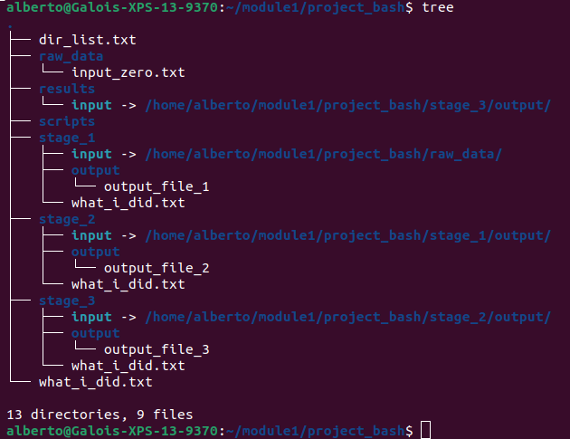

## Module 1 - Basic concepts of command line programming - Session 1

### 1. The filesystem 
This section outlines the basic commands for navigating file systems and creating a structured directory hierarchy for research projects. The naming of files and directories is more crucial than you might realize; a clear and consistent structure will significantly streamline your workflow, especially when dealing with complex projects and pipelines. While you can adapt and customize this template structure to your specific needs, adhering to these principles will greatly enhance project organization and accessibility.

We will start with creating a parent directory for our project. 
```sh
mkdir project_bash
cd project_bash
```
The first command (`mkdir`) creates the required folder while the `cd` command is used to move from your home directory to the newly created directory (`project_bash`). To make sure you are now in the right directory, you can use the `pwd` command which prints on screen the name of the current directory *i.e.* your current position in the file system. 

> [!IMPORTANT]
> Never use white spaces when naming files or directories

Now we need to create one directory where we are going to store our scripts, one for the raw data, and one for our results:

```sh
mkdir scripts; mkdir raw_data; mkdir RaSuLts
```

>[!NOTE]
> Use the semicolon (;) to separate different commands on the same line.

To assure yourself that all directories have been created you can use the command `ls` which lists the content of the current directory.

Do you notice anything strange? 

The word `results` is misspelt and the directory name is written in a mix of upper and lower case letters. Let's fix this!

One option is to delete the folder and create a new one with the correct name. You can achieve this by running:
```sh
rm -r RaSuLts
mkdir results
```
A second possibility is to move the directory (and its content) to a new directory with the correct name:
```sh
mv RaSuLts results
```
Now that we have corrected our mistake, we can start populating our directories starting with a `log` file. Maintaining a detailed record of executed commands is an essential practice for reproducibility and debugging purposes. By keeping a log of your actions, you can easily retrace your steps, identify potential errors, and effectively reproduce your work, even after a significant time gap.

To facilitate efficient command logging, it's recommended to adopt a consistent naming convention for your log files. In this case, we'll use the file name "what_i_did.txt" to store our command history. To create this empty log file, simply utilize the touch command:

```sh
touch what_i_did.txt
```
You can then edit this file manually using any text editor, such as `nano`.

```sh
nano what_i_did.txt
```
After editing the file you can then press `Ctrl X` to close the editor and press `enter` to save the changes.

> `Exercise 1`
>
> log all the command you have run so far in your `what_i_did.txt` file

You can visualize the content of this file using the command `cat path/to/file/file_name`

### 2. Loops and variables
Let's keep building up our file-system structure by creating a separate directory for each stage of our pipeline/analysis. Because of my lack of immagination, each directory will be termed as `stage` and we are going to number them sequentially but I would encourage you to use a better naming convention when it comes to your research. Given that typing the same command over and over is tedious, we are going to use one of the basics building blocks of any programming language: a loop.  

```sh
for i in $(seq 3)
do
mkdir stage_$i
done
```
Let's unpack this:

The `for` loop is a fundamental programming construct that allows you to execute a block of code repeatedly until a specific condition is met. In this particular instance, the loop iterates over the values generated by the seq command. 

The `seq` command produces a sequence of integers, and in this case, it generates the numbers from 1 to 3.

The `do` command marks the beginning of the block of code that will be executed repeatedly for each value of the iterator variable.

The variable `i` serves as the iterator, keeping track of the current position in the sequence. With each iteration, the value of `i` changes to the next number in the sequence, until it reaches the end of the sequence.

The `mkdir`command: Creates a directory each time (3 directories in total). 

The `done` command marks the end of the for loop, indicating that the loop should continue executing the enclosed block of code until the entire sequence of values has been processed.

This will create 3 directories called: `stage_1`, `stage_2`, `stage_3`.

Now type `ls` to ensure the directories have been indeed created.

Today we will create a very simple directory structure for our research project just to illustrate the principle. Each of our `stage` directories should contain three items:
- a what_i_did.txt file.
- an output sub-directory
- a sub-directory called input

In principles, you could navigate to the each stage directory using the `cd` command and create these objects manually but that involves a lot of typing. You should instead use a loop to avoid this tedious task. An efficient way to do this from a shell terminal requires to create a list of parent directories and then create the child directories only where we need them.
```sh
ls -d stage* > dir_list.txt
```
Here the `-d` option modifies the behaviour of the command `ls` and forces it to list only directories. 

Note the word `stage*` after the `-d` flag: this restricts our list of directories to those that are termed `stage` followed by any other character (`*`). 

Lastly, note the use of the `>`. This symbol in bash has a special meaning: redirect the output of the command that precedes it to a file (`dir_list.txt` in this case).

Now that we have the list, we can easily implement another type of loop using the reserved word `while`:
```sh
while read -r line
do
touch $line/what_i_did.txt
done < dir_list.txt
```
The `$` sign preceding the variable named `line` is crucial in this context because it indicates that we are referencing the actual value stored in the variable, rather than the variable name itself. During each iteration of the loop, the `read` command reads a line from the `dir_list.txt` file and assigns its content to the `line` variable. Finally the command `touch` uses the content of the variable `$line` to create a `what_i_did.txt` file inside the right directory.

> `Exercise 2`
>
> use a similar while loop to create a sub-directory called `output` inside each stage directory

In data processing pipelines, where the output of one step becomes the input for the next, it's often necessary to transfer data between directories. However, blindly copying files can lead to inefficient storage usage and unnecessary data duplication. A more effective approach is to utilize symbolic links, which provide a pointer to the original data rather than creating a new copy.

Consider the scenario where `stage_1/output` and `stage_2/input` contain identical data. Copying the entire contents from `stage_1/output` to `stage_2/input` would result in redundant storage of the same data, consuming unnecessary disk space.

Symbolic links offer a solution to this issue. Instead of replicating the data, a symbolic link is created in `stage_2/input`, pointing to the original data in `stage_1/output`. This link acts as a shortcut, directing the system to the actual data location whenever the input directory is accessed.

Here is an example of symbolic links:

```sh
ln -s ~/project_bash/raw_data/ ~/project_bash/stage_1/input
```
The `ln` command stands for ”link” and it has this general syntax:
```sh
ln full/path/to/source full/path/to/destination/link_name
```
Here we have used the `-s` flag to specify a symbolic link between the `raw_data` directory and a new `input` folder (link name) inside the `stage_1 directory`. This means that the content of `raw_data` is now accessible from `stage_1/input`. Let’s double-check:
```sh
touch raw_data/input_zero.txt
ls stage_1
ls stage_1/input
ls raw_data
```
The first command is just to populate the `raw_data` folder with a file (`input_zero.txt`). By running the second command you should see that an `input` folder has been created via the `ln` command. Now the `stage_1` directory contains all three elements required. The output of the third and fourth commands should be just `input_zero.txt`.

> `Exercise 3`
>
> Use the `ln` command to complete our file system structure
> by linking each `stage_{i}/output` to an input folder inside the `stage_{i+1}` directory.
> Note that in our example stage_4 is actually termed results.

If you have made a mistake with links, do not panic. You can alwayse remove them with `rm` or with the `unlink` command.

Now that we have a good structure we can start populating our directories. Let's create some files in the `project_bash` directory.

```sh
for i in $(seq 3)
do
touch output_file_$i
done
```
Now we should move each of these file to the corresponding `stage_{i}/output` directory.

> `Exercise 4`
>
> Use a for loop to move each of the output_file_{i} ∀i ∈ {1, 2, 3} to its own directory.
> 
> To do so, you should use the `mv` command which has the following syntax: `mv target_file_name path/to/destination`.


If you now run the `tree` command from the project_bash directory, you should get:




Now that we have 

```sh
cd; mkdir module1;
cd module1
mv ~/project_bash ./
```
